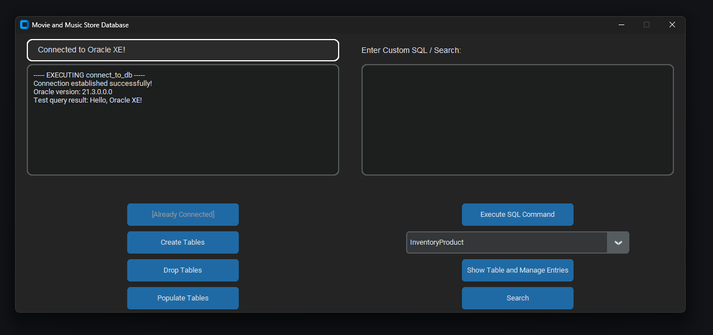
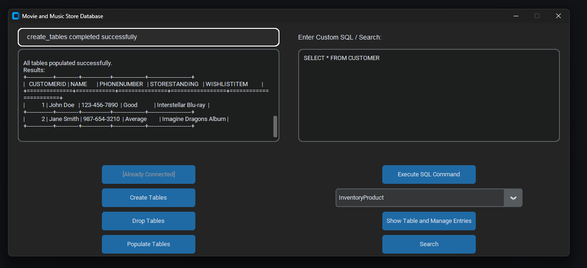
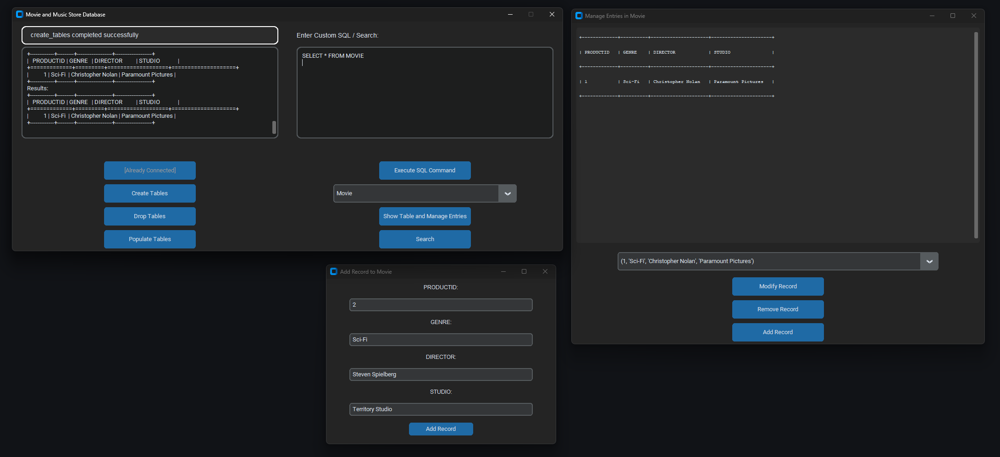

# Music and Movie Store Oracle Database Application

A Python application to interact with an Oracle Database intended for a Movie and Music store. This tool provides a simple UI to display tables, manage entries, and execute custom SQL queries.

## Features

- **Display Tables**: View database tables in an easy-to-read format.
- **Manage Entries**: Add, edit, or delete records in tables.
- **Search Functionality**: Search for specific terms across multiple tables.
- **Custom SQL Execution**: Run your own SQL queries directly from the UI.
- **Interactive GUI**: Built with CustomTkinter for a clean and modern user experience.

---

## Prerequisites

Ensure the following are installed on your system:

1. **Python 3.8+**
2. **Required Python Libraries**: Install these via pip:
   ```
   pip install cx_Oracle customtkinter tabulate
   ```
3. **Oracle Instant Client**: Download and install the appropriate version for your system from the [Oracle Instant Client Downloads](https://www.oracle.com/database/technologies/instant-client.html).
4. **Oracle XE 21c**: Install Oracle XE for the database server. Default settings will work with this app.

---

## Setup

### 1. Database Configuration
Update the following in the code (`main.py`) to match your Oracle Database credentials:
```
user = "SYS"  # Connecting as SYS user
password = "your_password"  # Replace with your SYS user password
dsn = cx_Oracle.makedsn("localhost", 1521, service_name="XE")  # Default Oracle XE service name
```

### 2. Oracle Instant Client Path
If needed, add the path to the Oracle Instant Client in the code:
```
cx_Oracle.init_oracle_client(lib_dir="path_to_instant_client")  # Replace with your Instant Client's path
```

---

## Usage

1. **Run the Application**: Use the following command to start the app:
   ```
   python main.py
   ```
2. **UI Features**:
   - **Connect to DB**: Establish a connection to the Oracle Database.
   - **Create Tables**: Create required tables in the database.
   - **Drop Tables**: Drop all tables from the database.
   - **Populate Tables**: Insert sample data into the tables.
   - **Execute SQL Command**: Run custom SQL queries.
   - **Manage Entries**: View, add, or delete records in tables.
   - **Search**: Search for a term across multiple tables.

---

## Supported Tables

The application supports the following database tables:

- `InventoryProduct`
- `Transactions`
- `InventoryCustomer`
- `Rentals`
- `Customer`
- `Movie`
- `Music`
- `ProductSupplier`
- `Inventory`
- `Product`
- `Supplier`

---

### Application Screenshots

Below are some screenshots demonstrating the functionality of the database application:

1. **Database Connection**  
     
   This screenshot shows the database GUI as it opens and establishes a connection to the Oracle database.

2. **Executing Queries**  
     
   Here, a query is being executed as written on the right, and the results are displayed in the left box of the application.

3. **Managing Movie Records**  
     
   This screenshot showcases multiple components: the movie table view, a query fetching all movie records, and a pop-up window for adding a new movie to the database.


---

## Troubleshooting

1. **cx_Oracle Import Error**: Ensure that the Oracle Instant Client is installed, and its path is correctly set using `cx_Oracle.init_oracle_client`.
2. **Database Connection Issues**: Verify that the Oracle XE service is running and accessible on port `1521`.
2.1. **Error connecting to database: ORA-12541**: Open up services.msc and start the `OracleOraDB21Home2TNSListener` service.

